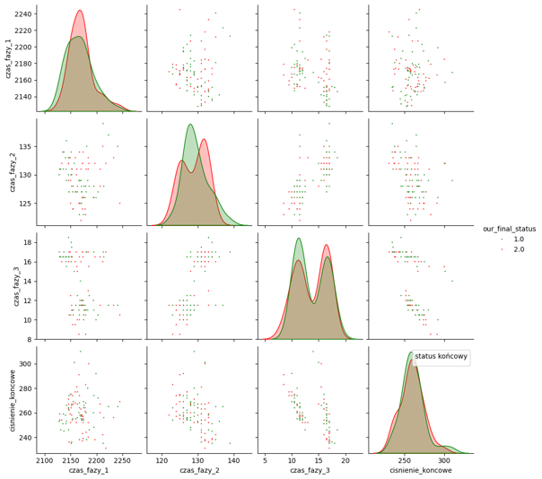
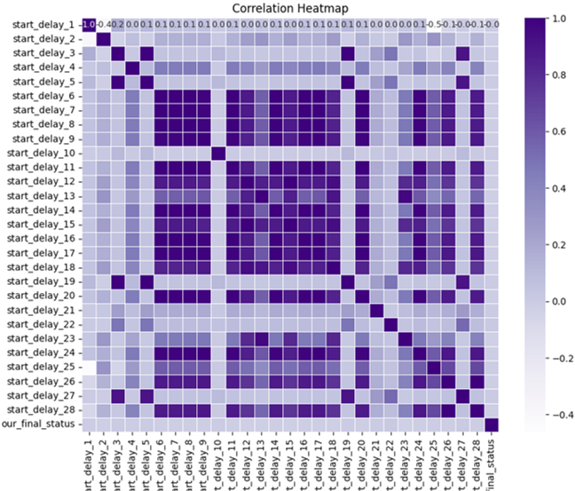
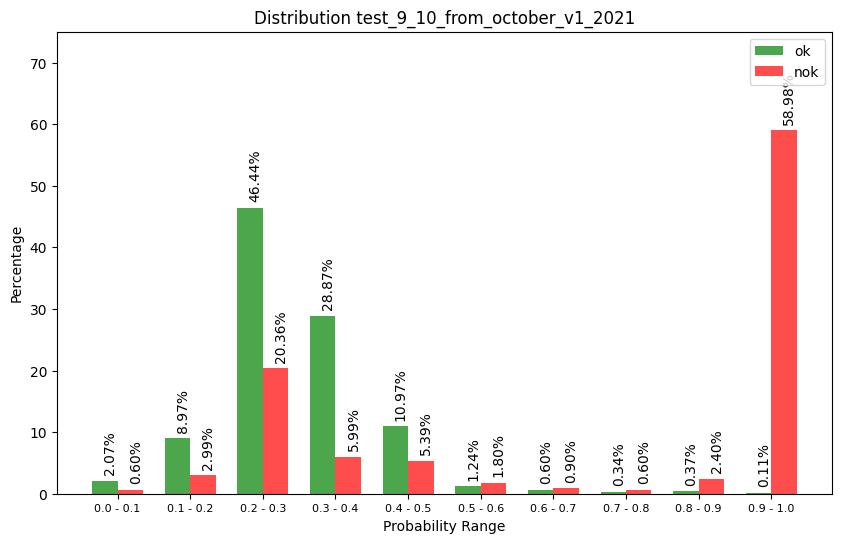
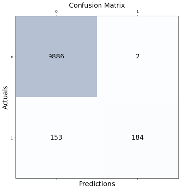

# Predicting quality status for metal part just after casting process based on machine parameters

The purpose of the project is to detect NOK parts immediately after the casting process, before the parts go through machining and other processes.

## Table of Contents

1. [About](#about)
2. [Features](#features)
3. [File structure](#file-structure)
4. [Data](#data)
5. [Model](#model)

## About

Before a metal car part can be manufactured it has to go a long way, starting with casting and ending with packaging for shipment. This involves costs as well as time.  In most cases, it is only at the end of the process that we find out whether the part meets the quality requirements. But what if we could determine the quality of a part after the casting process itself, based on the parameters with which the part was cast?  

This problem is solved by our project. Which, based on casting parameters such as e.g. final pressure, casting temperature, overflow of cooling circuits, makes a prediction as to whether the cast part will be OK or NOK. 

As a result, we are able to reject a part that does not meet the quality requirements after the first production process, saving both time and money on part processing.

This project uses supervised learning techniques to perform binary classification based on historical data. The classification includes two classes: 

**0 - OK**

**1 - NOK**

## Features

The total scope of the project included:

• reading the data from database (historical data);

• dataset analysis and data processing;

• implement mlflow to save and analyse trained models

• choosing proper model to work with this task;

• parametrizing model during teaching process;

• creating pipeline to work with production data;

## File structure

[creating_datasets.py](src/creating_datasets.py) - Main file that executes functions to create, train, test and validate datasets for different machines.

[table_functions.py](src/table_functions.py) - Functions to drop unused columns, combine final table, define prediction class, normalise and standardise data, over- and under-sample, drop columns with too much correlation.

[analyze_visualisation.py](src/analyze_visualisation.py) - Functions to analyse the data (pair plots, heat maps etc.)

[ml_functions.py](src/ml_functions.py) - Functions to create confusion matrix, distribution of probability for specific class

[pipeline.py](src/pipeline.py) - Program to live-load latest records from database and make predictions

[ml_models directory](src/ml_models) - Python files for each ML algorithm like xgboost, neural networks, random forest etc.

## Data

Database that we work with contains more than 300 parameters and 1 500 000 records. It means that for each part we have about 300 parameters, where most of them is from casting process.
Data properties:

1. In most cases, parameters for OK and NOK parts are smiliar.

2. Most of the data was higly correlated, so we need to reject them from dataset

## Model

The aim of our model was to achieve NOK part detection of 50% at decision threshold at level of 0,9. That the model will predict part as NOK with very high probability. Finally we achived NOK part detection of 60%. To find the best model for our usecase we tested few algorithms: decision tree, random forest, neural networks, xg_boost. The best performance had **xgboost**.

To choose the besto model for our usecase in addition to use parameters like accuracy, recall etc. we have made plot, that shows distribution of probability for each class on test data. Which help us to choose best model and threshold.

Confusion matrix for our model on test data, with the classification threshold = 0.925: 

